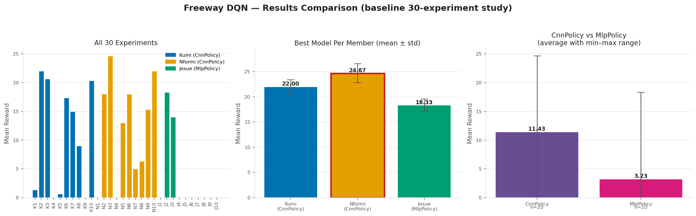

# Formative 3 — Deep Q-Learning on Atari Freeway

Train and evaluate a **DQN** agent on **ALE/Freeway-v5** using Stable Baselines3 and Gymnasium.

**Team**

| Member           | Policy    | Role                               |
| ---------------- | --------- | ---------------------------------- |
| Kumi Yunis       | CnnPolicy | 10 hyperparameter experiments      |
| Nformi Modestine | CnnPolicy | 10 hyperparameter experiments      |
| Josue Byiringiro | MlpPolicy | 10 hyperparameter experiments (v2) |

---

## Environment — ALE/Freeway-v5

The agent controls a chicken that must cross a busy road.

- **Goal:** Cross from bottom to top as many times as possible.
- **Reward:** +1 for each successful crossing.
- **Actions:** NOOP, UP, DOWN (3 actions).
- **Observations:** RGB frames (CnnPolicy) or RAM state (MlpPolicy).

---

## Team and Policies

| Member           | Policy    | Observation | Results folder       |
| ---------------- | --------- | ----------- | -------------------- |
| Kumi Yunis       | CnnPolicy | RGB frames  | `runs_kumi_dqn/`   |
| Nformi Modestine | CnnPolicy | RGB frames  | `runs_nformi_dqn/` |
| Josue Byiringiro | MlpPolicy | RAM state   | `runs_josue_v2/`   |

Each member tested **10 different hyperparameter combinations**.

**Note:** The assignment calls it `epsilon_decay`. In Stable Baselines3 this is `exploration_fraction` — how much of training is spent decaying epsilon from start to end.

---

## How to Run

```bash
pip install -r requirements.txt

# Train all experiments (Kumi, Nformi, Josue v1 in train.py)
python train.py

# Josue's main study (v2 — 200k steps)
python run_josue_v2.py

# Play with the best model (Greedy Q-policy + GUI)
python play.py
python play.py kumi
python play.py nformi
python play.py josue
```

`play.py` loads the model, uses `deterministic=True` (always picks the highest Q-value), and shows the game with `env.render()`.

---

## Hyperparameter Tuning

### Kumi Yunis — CnnPolicy (100k steps)

| Exp | lr     | gamma | batch | eps_start | eps_end | eps_fraction | Mean Reward     | Noted Behavior                                            |
| --- | ------ | ----- | ----- | --------- | ------- | ------------ | --------------- | --------------------------------------------------------- |
| 1   | 1e-4   | 0.99  | 32    | 1.0       | 0.10    | 0.10         | 1.33            | Baseline. Learning rate too low — barely learned.        |
| 2   | 5e-4   | 0.99  | 32    | 1.0       | 0.10    | 0.10         | **22.00** | **Best for Kumi.** Higher lr learned fast and well. |
| 3   | 2.5e-4 | 0.99  | 32    | 1.0       | 0.10    | 0.10         | 20.67           | Medium lr — almost as strong as Exp 2.                   |
| 4   | 1e-4   | 0.95  | 32    | 1.0       | 0.10    | 0.10         | 0.00            | Low gamma — agent too short-sighted for Freeway.         |
| 5   | 1e-4   | 0.999 | 32    | 1.0       | 0.10    | 0.10         | 0.67            | Very high gamma + low lr — almost no learning.           |
| 6   | 1e-4   | 0.99  | 64    | 1.0       | 0.10    | 0.10         | 17.33           | Larger batch helped a lot vs baseline.                    |
| 7   | 1e-4   | 0.99  | 32    | 1.0       | 0.05    | 0.10         | 15.00           | Lower eps_end (more greedy) helped vs baseline.           |
| 8   | 1e-4   | 0.99  | 32    | 1.0       | 0.10    | 0.20         | 9.00            | Longer exploration — some gain, high variance.           |
| 9   | 1e-4   | 0.99  | 32    | 1.0       | 0.02    | 0.25         | 0.00            | Long explore + very low eps_end at low lr — failed.      |
| 10  | 5e-5   | 0.995 | 64    | 1.0       | 0.05    | 0.15         | 20.33           | Conservative combo — surprisingly strong.                |

**Key insights (Kumi)**

- **Improved:** Higher learning rate (Exp 2, 3). Larger batch (Exp 6). Lower eps_end (Exp 7).
- **Harmed:** Low or very high gamma (Exp 4, 5). Long exploration with low lr (Exp 9).
- **Best:** Exp 2 — `lr=5e-4, gamma=0.99, batch=32, eps 1.0→0.10, frac=0.10` (mean reward **22.0**).
- With only 100k steps, a higher learning rate mattered most.

---

### Nformi Modestine — CnnPolicy (100k steps)

| Exp | lr      | gamma | batch | eps_start | eps_end | eps_fraction | Mean Reward     | Noted Behavior                                                   |
| --- | ------- | ----- | ----- | --------- | ------- | ------------ | --------------- | ---------------------------------------------------------------- |
| 1   | 1e-4    | 0.99  | 16    | 1.0       | 0.10    | 0.10         | 0.00            | Small batch + low lr — never learned to cross.                  |
| 2   | 1e-4    | 0.99  | 128   | 1.0       | 0.10    | 0.10         | 18.00           | Large batch rescued the low lr — strong and stable.             |
| 3   | 3e-4    | 0.99  | 32    | 1.0       | 0.10    | 0.10         | **24.67** | **Best overall.** Moderately higher lr was the sweet spot. |
| 4   | 1e-4    | 0.90  | 32    | 1.0       | 0.10    | 0.10         | 0.00            | Much lower gamma — too short-sighted.                           |
| 5   | 1e-4    | 0.99  | 32    | 0.5       | 0.10    | 0.10         | 13.00           | Lower eps_start — less early exploring, moderate result.        |
| 6   | 1e-4    | 0.99  | 32    | 1.0       | 0.10    | 0.05         | 18.00           | Short exploration still learned well.                            |
| 7   | 1e-4    | 0.99  | 32    | 1.0       | 0.01    | 0.10         | 5.00            | Very low eps_end — under-explored, weak.                        |
| 8   | 6.25e-5 | 0.99  | 32    | 1.0       | 0.10    | 0.10         | 6.33            | Lower lr — slow and unstable.                                   |
| 9   | 1e-4    | 0.99  | 64    | 1.0       | 0.05    | 0.20         | 15.33           | Bigger batch + longer explore — decent.                         |
| 10  | 2.5e-4  | 0.98  | 64    | 1.0       | 0.10    | 0.15         | 22.00           | Combined moderate tweak — second best.                          |

**Key insights (Nformi)**

- **Improved:** Moderately higher lr (Exp 3). Large batch at low lr (Exp 2). Combined tweak (Exp 10).
- **Harmed:** Very small batch (Exp 1). Very low gamma (Exp 4). Very low eps_end (Exp 7). Even lower lr (Exp 8).
- **Best:** Exp 3 — `lr=3e-4, gamma=0.99, batch=32, eps 1.0→0.10, frac=0.10` (mean reward **24.67**).
- Same low lr: batch 16 failed, batch 128 worked — batch size can help when lr is small.

---

### Josue Byiringiro — MlpPolicy (v2, 200k steps)

Josue uses **version 2** as the main study. In v1 (100k steps), only high learning rates learned; most runs scored 0. v2 fixed that by:

- centering learning rates on `3e-4`–`1e-3`
- doubling training to **200k** steps
- changing gamma / batch / epsilon **on top of** a working lr

| Exp | lr   | gamma | batch | eps_start | eps_end | eps_fraction | Mean Reward     | Noted Behavior                                                  |
| --- | ---- | ----- | ----- | --------- | ------- | ------------ | --------------- | --------------------------------------------------------------- |
| 1   | 3e-4 | 0.99  | 32    | 1.0       | 0.10    | 0.10         | 0.00            | Same lr worked for CNN but failed for MLP.                      |
| 2   | 5e-4 | 0.99  | 32    | 1.0       | 0.10    | 0.10         | **23.33** | **Best.** Same as v1 best lr, but higher with more steps. |
| 3   | 1e-3 | 0.99  | 32    | 1.0       | 0.10    | 0.10         | 0.00            | Too aggressive for MLP — no learning.                          |
| 4   | 7e-4 | 0.99  | 32    | 1.0       | 0.10    | 0.10         | **23.33** | Tied for best; more stable (low std).                           |
| 5   | 5e-4 | 0.99  | 64    | 1.0       | 0.10    | 0.10         | 0.00            | One change (larger batch) collapsed learning.                   |
| 6   | 5e-4 | 0.99  | 128   | 1.0       | 0.10    | 0.10         | 0.00            | Much larger batch — also collapsed.                            |
| 7   | 5e-4 | 0.995 | 32    | 1.0       | 0.10    | 0.10         | 0.00            | Higher gamma at working lr — failed.                           |
| 8   | 5e-4 | 0.99  | 32    | 1.0       | 0.05    | 0.10         | 0.00            | Lower eps_end — failed.                                        |
| 9   | 5e-4 | 0.99  | 32    | 1.0       | 0.10    | 0.20         | 0.00            | Longer exploration — failed.                                   |
| 10  | 3e-4 | 0.99  | 64    | 1.0       | 0.05    | 0.15         | 0.00            | Combo on 3e-4 base — no learning.                              |

**Key insights (Josue)**

- **Improved:** Higher lr in the right band (`5e-4` / `7e-4`) and more training time.
- **Harmed:** Changing batch, gamma, or epsilon even at a good lr often failed — MLP on RAM is brittle.
- **Best:** Exp 2 or Exp 4 — mean reward **23.33**. Exp 4 (`lr=7e-4`) was more stable.
- MLP can reach high scores, but many nearby configs score 0. CNN was more reliable.

---

## CNN vs MLP

| Policy               | Best mean reward | Observation |
| -------------------- | ---------------- | ----------- |
| CnnPolicy (Nformi)   | **24.67**  | RGB pixels  |
| CnnPolicy (Kumi)     | 22.00            | RGB pixels  |
| MlpPolicy (Josue v2) | 23.33            | RAM         |

**CnnPolicy performed better overall.** Freeway needs spatial understanding (cars, lanes, chicken). A CNN learns from pixels. An MLP on RAM can work with a good lr, but it was less stable across small hyperparameter changes.

---

## Best Overall Model

| Field       | Value                            |
| ----------- | -------------------------------- |
| Winner      | Nformi Modestine — Experiment 3 |
| Policy      | CnnPolicy                        |
| lr          | 3e-4                             |
| gamma       | 0.99                             |
| batch_size  | 32                               |
| epsilon     | 1.0 → 0.10, fraction 0.10       |
| Mean reward | **24.67**                  |

Saved as:

- `dqn_model.zip`
- `best_overall_model/dqn_model.zip`
- `best_overall_model/best_model_metadata.json`

---

## Comparison Chart



---

## Gameplay Video

The video shows `play.py` running with the best model on Freeway (Greedy Q-policy).

**video link:**

- Location: `video/freeway_play.mp4`
- YouTube link: [https://youtu.be/YjOYt_grD0Y](https://youtu.be/YjOYt_grD0Y)

## Project Files

| File / folder                   | What it is                             |
| ------------------------------- | -------------------------------------- |
| `train.py`                    | Trains DQN experiments for the team    |
| `run_josue_v2.py`             | Josue's v2 MLP study (200k steps)      |
| `play.py`                     | Loads model and plays Freeway with GUI |
| `requirements.txt`            | Dependencies                           |
| `dqn_model.zip`               | Best overall trained model             |
| `all_experiments_summary.csv` | Combined results table                 |
| `comparison_chart.png`        | Results chart                          |
| `runs_kumi_dqn/`              | Kumi's runs and logs                   |
| `runs_nformi_dqn/`            | Nformi's runs and logs                 |
| `runs_josue_v2/`              | Josue's v2 runs and logs               |
| `best_overall_model/`         | Best model + metadata                  |

Each experiment folder includes `episode_log.csv` (reward and episode length) and `run_metadata.json`.
